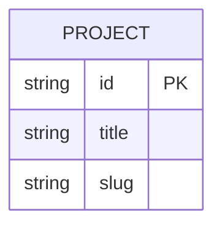

# ドキュメント規約

## ファイル命名規則

### 基本ルール
- **ケバブケース**: `project-page.md`, `site-setting.md`
- **単数形**: `project.md` (not `projects.md`)
- **説明的な名前**: `requirements.md`, `tech-stack.md`

### ディレクトリ構造
```
docs/
├── index.md              # トップページ
├── requirements/         # 要件定義
├── pages/               # ページ実装方針
├── microCMS/            # API定義
└── tech-stack.md        # 技術選定
```

## Markdown記法規約

### Front Matter
必須項目を含める:

```yaml
---
sidebar_label: [表示名]
title: [ページタイトル]
---
```

### 見出し構造
- H1 (`#`) はページタイトルのみ（Front Matterのtitleと同じ）
- H2 (`##`) はセクション
- H3 (`###`) はサブセクション
- H4以降は極力避ける

### リンク参照
相対パスで記述:

```markdown
✅ Good:
- [活動実績 API定義](../microCMS/project.md)
- [要件定義](./requirements/requirements.md)

❌ Bad:
- [活動実績 API定義](/microCMS/project.md)  # 絶対パス
- [活動実績 API定義](../microCMS/projects.md)  # 複数形
```

### テーブル記法
統一されたフォーマット:

```markdown
| フィールドID | 名前 | 種別 | 必須 | 説明 |
|------------|------|------|------|------|
| `title` | タイトル | text | ○ | 記事のタイトル |
```

## ページ構成のテンプレート

### API定義ページ
```markdown
---
sidebar_label: [API名] API定義
title: [API名] API定義
---

## 概要
- **API ID**: `[api-id]`
- **API種別**: リスト形式 or オブジェクト形式
- **用途**: [説明]

## フィールド構成
[テーブル]

## データ例
[JSON]

## 主要クエリパターン
[クエリ例]

## 設計方針
[理由・意図]
```

### ページ実装方針
```markdown
---
sidebar_label: [ページ名]
title: [ページ名]
---

## 1. ページ目的・KPI
## 2. 情報構成(IA)
## 3. セクション別 実装方針
## 4. ルーティング・情報設計
## 5. データモデル
[microCMS API定義への参照]

## 6. 取得・描画戦略
## 7. パフォーマンス・SEO
```

## 編集時の注意点

### 1. ビルドエラーを確認
編集後は必ずビルドが通ることを確認:

```bash
cd docusaurus
npm run build
```

### 2. サイドバーの更新
新しいドキュメントを追加した場合は `sidebars.ts` を更新:

```typescript
const sidebars: SidebarsConfig = {
  docs: [
    'index',
    {
      type: 'category',
      label: 'microCMS設計',
      items: [
        'microCMS/index',
        'microCMS/project',
        'microCMS/blog',
        // 新しいファイルを追加
      ],
    },
  ],
};
```

### 3. リンク切れチェック
Docusaurusはリンク切れを自動検出:
- ビルド時に警告・エラーが表示される
- 修正するまでビルドが失敗する

## コードブロック

### 言語指定
```markdown
✅ Good:
```typescript
const example = "code";
`` `

❌ Bad:
```
const example = "code";  // 言語指定なし
`` `
```

### JSON例
整形されたJSON:

```json
{
  "id": "example-001",
  "title": "Example Title",
  "slug": "example-slug"
}
```

## 図表・ダイアグラム

### Mermaid記法
Docusaurusはmermaidをサポート:



## 更新履歴

- ドキュメント内に更新履歴は記載しない
- Gitのコミット履歴で管理

## 参考リンク記法

URLは必ず記載:

```markdown
## 参考リンク

- **Figmaデザイン**: https://www.figma.com/...
- **ヒアリングシート**: [Google Spreadsheet](https://docs.google.com/...)
```

## ベストプラクティス

### 1. 簡潔な説明
- 冗長な説明は避ける
- 箇条書きを活用

### 2. 実例を含める
- 抽象的な説明だけでなく、具体例を示す
- Good/Bad例を並べる

### 3. 目的を明確に
- 「なぜそうするのか」を記載
- 設計意図を残す

### 4. アクセシビリティ不要
- 初期段階ではshadcn/ui（Radix UIベース）で対応済み
- 各ページ仕様から「アクセシビリティ」セクションは削除済み

### 5. データモデルは参照リンク
- 詳細はmicroCMS定義に記載
- ページ仕様では参照リンクのみ
