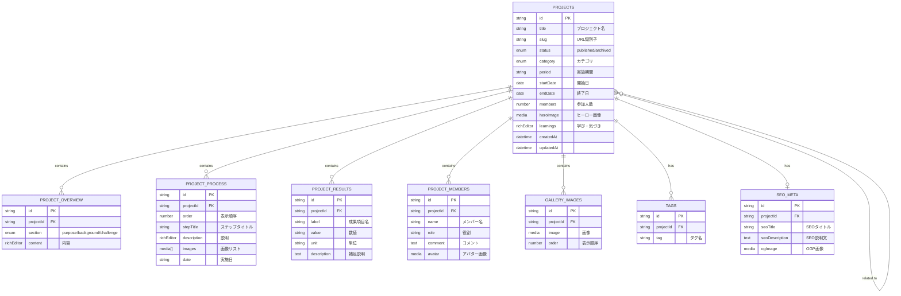

# microCMS ER図



## エンティティ説明

### PROJECTS (親エンティティ)
プロジェクトのメイン情報を格納。他のすべてのエンティティはこれに紐づく。

#### 主要属性
- **id**: プロジェクト固有ID (microCMS自動生成)
- **title**: プロジェクト名 (必須)
- **slug**: URL用スラッグ (必須、ユニーク)
- **status**: 公開状態 (`published` or `archived`)
- **category**: カテゴリ (business-contest, volunteer, lecture, learning, other)
- **period**: 実施期間の文字列表現
- **startDate/endDate**: ソート・フィルタ用の日付
- **members**: 参加人数
- **heroImage**: メイン画像
- **learnings**: プロジェクトから得た学び (リッチテキスト)

### PROJECT_OVERVIEW (1:N)
プロジェクトの概要を構造化して格納。目的・背景・課題の3セクション。

#### 属性
- **section**: `purpose` (目的) / `background` (背景) / `challenge` (課題設定)
- **content**: リッチエディタで編集可能な本文

### PROJECT_PROCESS (1:N)
活動のステップ・タイムラインを時系列で格納。

#### 属性
- **order**: 表示順序 (昇順ソート用)
- **stepTitle**: ステップの見出し
- **description**: ステップの詳細 (リッチテキスト)
- **images**: 複数の関連画像
- **date**: 実施日 (任意、文字列)

### PROJECT_RESULTS (1:N)
プロジェクトの成果を定量・定性データで格納。

#### 属性
- **label**: 成果項目名 (例: "参加者数", "開催回数")
- **value**: 数値 (文字列型、柔軟性のため)
- **unit**: 単位 (例: "名", "回", "件")
- **description**: 補足説明

### PROJECT_MEMBERS (1:N)
プロジェクト参加メンバーの情報。

#### 属性
- **name**: メンバー名
- **role**: 役割 (例: "リーダー", "企画担当")
- **comment**: メンバーからの一言コメント
- **avatar**: プロフィール画像

### GALLERY_IMAGES (1:N)
ヒーロー画像以外の追加画像を格納。

#### 属性
- **image**: 画像ファイル
- **order**: 表示順序

### TAGS (1:N)
検索・分類用のタグ。複数タグ対応。

#### 属性
- **tag**: タグ名

### SEO_META (1:1)
SEO・OGP用のメタ情報。

#### 属性
- **seoTitle**: メタタイトル (未入力時はtitleをフォールバック)
- **seoDescription**: メタディスクリプション
- **ogImage**: SNSシェア用画像 (未入力時はheroImageをフォールバック)

### 関連プロジェクト (N:N)
PROJECTSエンティティ同士の自己参照リレーション。
同カテゴリや時系列で関連するプロジェクトを手動で紐付け可能。

---

## データフロー

```
┌─────────────────┐
│  microCMS API   │
│   (projects)    │
└────────┬────────┘
         │
         ↓ GET /api/v1/projects
┌─────────────────┐
│   Next.js App   │
│  (SSG/ISR)      │
└────────┬────────┘
         │
         ↓ ページレンダリング
┌─────────────────┐
│  プロジェクト    │
│  詳細ページ      │
│ /projects/[slug]│
└─────────────────┘
```

### 主要クエリパターン

1. **一覧取得（トップページ用）**
   ```
   GET /api/v1/projects?limit=3&filters=status[equals]published&orders=-startDate
   ```
   - 公開中のプロジェクトを最新3件取得

2. **詳細取得**
   ```
   GET /api/v1/projects/[slug]
   ```
   - スラッグでプロジェクト詳細を取得

3. **カテゴリ別取得**
   ```
   GET /api/v1/projects?filters=category[equals]volunteer,status[equals]published
   ```
   - カテゴリでフィルタ

4. **関連プロジェクト取得**
   ```
   GET /api/v1/projects?filters=category[equals][カテゴリ]&limit=3
   ```
   - 同カテゴリのプロジェクトを取得

---

## インデックス推奨

パフォーマンス最適化のため、以下のフィールドにインデックスを設定推奨:
- `slug` (ユニーク検索)
- `status` (公開フィルタ)
- `category` (カテゴリフィルタ)
- `startDate` (日付ソート)
